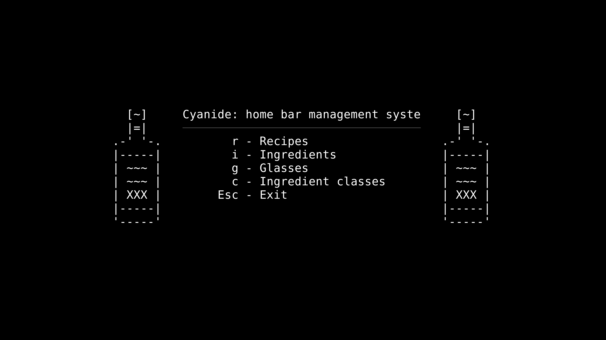

# Cyanide: home bar management system

## What is cyanide?

Cyanide is an ncurses-style console application that tracks and manages
ingredients and recipes for a home bar. It can track current inventory and past
purchases for ingredients, show you what recipes you can make with your current
inventory, and filter recipes by spirit type, glass, and a search string.



More screenshots (which may or may not be out of date) are available in the
[screenshots directory][screenshots].

## Running cyanide

Cyanide was developed, tested, and is actively used on Linux. It's possible it
will run without issue on MacOS or Windows, but this hasn't been attempted.

Running concurrent copies of cyanide is not recommended. It could be fine, but
if data is being modified the changes may not appear across all instances.

Cyanide requires a working PostgreSQL database to store data in. Cyanide
attempts to create the tables it needs when it is run.

### Docker images

A docker image is available on [quay.io][quay.io]. It uses the default
configuration shown below, so it'll attempt to connect to a PostgreSQL database
on `localhost`, using the user `cyanide` and the database `cyanide`. If such a
database is set up and configured properly, cyanide can be run with the
following command:

```
docker run --rm -it --net=host quay.io/dgonyeo/cyanide
```

A quick explainer on the flags, `--rm` will remove any leftover container once
cyanide exits (which is fine since all state is stored in PostgreSQL), `-it`
will make the container interactive and allocate a tty for cyanide to draw to,
and `--net=host` shares the host's networking with the container, so that
cyanide will be able to access the database on `localhost`.

To change the database configuration or editor used, it would probably be best
to mount in a modified config to `/root/.config/cyanide/cyanide.conf`.

### Binaries

Cyanide can be downloaded from the [releases page on GitHub][releases]:

```
curl -o cyanide https://github.com/dgonyeo/cyanide/releases/download/v0.1.0/cyanide-linux-glibc
chmod +x cyanide
```

Cyanide can also be built from source with [stack][stack]. Note that you'll need
to either modify `stack.yaml` or have a working [nix][nix] install to build
cyanide.

```
git clone https://github.com/dgonyeo/cyanide
cd cyanide
stack install
```

Once acquired, cyanide must be configured via a configuration file stored at
`~/.config/cyanide/cyanide.conf`. If this file doesn't exist when cyanide is
run, the user will be asked if it should be created. The default file looks like
this:

```
[DATABASE]
host = localhost
port = 5432
user = cyanide
password = cyanide
database = cyanide

[EDITOR]
editor =
```

This file can be edited to alter the database configuration, and change the
editor. If the editor is unset, the `$EDITOR` environment variable is used, and
if that is also unset then `vim` is used. The editor is used for modifying
recipe instructions, and it's recommended to configure the editor to enable
spell checking.

## Recipe database

Entering in recipes by hand is very tedious, and ideally cyanide would ship with
a set of default recipes. Unfortunately until permissions to republish recipes
are acquired or a public domain data set is found, such a recipe list cannot be
freely distributed.

## License

[GPLv3][licensefile]

[releases]: https://github.com/dgonyeo/cyanide/releases
[stack]: https://docs.haskellstack.org/en/stable/README/
[nix]: https://nixos.org/nix/
[quay.io]: https://quay.io/repository/dgonyeo/cyanide?tag=latest&tab=tags
[licensefile]: LICENSE
[screenshots]: screenshots
